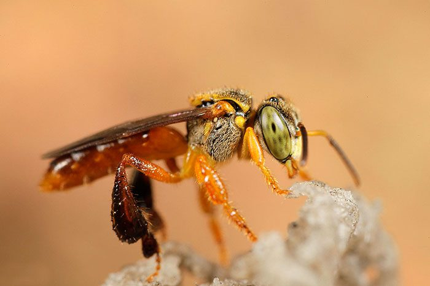

# 🐝 Abelha Jataí

  

  <i>Tetragonisca angustula — Abelha Jataí</i>

---

## 🔬 Sobre a Jataí

A **Jataí** (*Tetragonisca angustula*) é uma espécie de **abelha sem ferrão** encontrada em diversas regiões da América Latina.

É uma abelha de pequeno porte, conhecida por sua importância na **polinização** e pela produção de mel. Por não possuir um ferrão funcional, utiliza outros mecanismos para proteger sua colônia.

A Jataí vive naturalmente em cavidades de árvores, muros, estruturas e outros locais protegidos, formando colônias organizadas e adaptadas ao ambiente.

Sua criação e manejo fazem parte da **meliponicultura**, área dedicada ao estudo e criação de abelhas nativas sem ferrão.

---

## 🌱 Importância

As abelhas possuem um papel fundamental nos ecossistemas, principalmente na **polinização das plantas**.

O estudo da Jataí também permite explorar diferentes áreas do conhecimento, como:

- 🐝 Biologia
- 🌱 Ecologia
- 🔬 Ciência
- 🍯 Meliponicultura
- 📊 Análise de dados
- 💻 Tecnologia

---

## 🚀 Sobre este projeto

Este repositório será dedicado ao desenvolvimento de **projetos, estudos e experimentos relacionados à abelha Jataí**.

A proposta é unir **conhecimento científico, engenharia e tecnologia** para desenvolver soluções que possam auxiliar no estudo, criação e monitoramento dessas abelhas.

Entre os projetos que poderão ser desenvolvidos estão:

- 🏠 Casas e colmeias para Jataí
- 📐 Desenhos técnicos
- 🧊 Modelos 3D no SolidWorks
- 📡 Casas monitoradas
- 🔌 Sistemas eletrônicos
- 🌡️ Monitoramento de condições ambientais
- ⚖️ Sistemas de pesagem
- 📊 Coleta e análise de dados
- 💻 Programas e códigos
- 📱 Aplicativos
- 🌐 Monitoramento remoto
- 🔬 Experimentos e estudos

Cada projeto terá sua própria documentação, apresentando o processo de desenvolvimento, materiais, códigos, modelos, testes e resultados quando aplicável.

---

## 🔓 Conhecimento Aberto

A ideia deste projeto é **compartilhar conhecimento e tornar os projetos acessíveis**.

Sempre que possível, códigos, desenhos, modelos, esquemas, estudos e documentações serão disponibilizados gratuitamente para que outras pessoas possam:

- 📖 Estudar
- 🛠️ Reproduzir
- 🔧 Modificar
- 💡 Adaptar
- 🧪 Experimentar
- 🚀 Criar novas soluções

> **Criar → Projetar → Construir → Testar → Aprender → Compartilhar**

### 💎 "Transmitir conhecimento é uma das maiores riquezas."

---

## 🚧 Status

🟡 **Projeto em desenvolvimento**

Novos projetos, estudos e experimentos serão adicionados conforme o desenvolvimento avançar.

---

  🐝 <strong>Estudar a natureza, construir soluções e compartilhar conhecimento.</strong>

